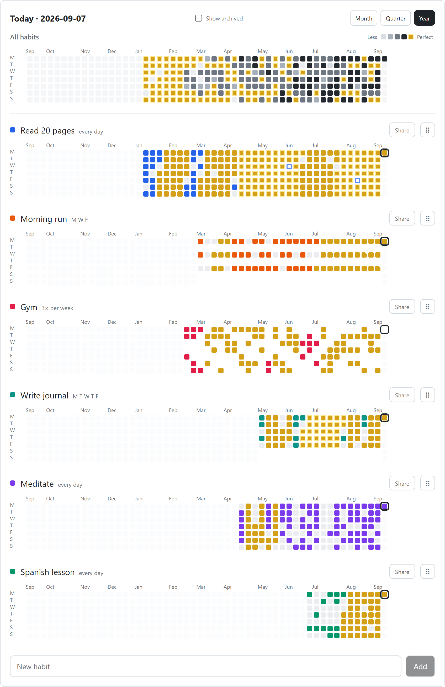
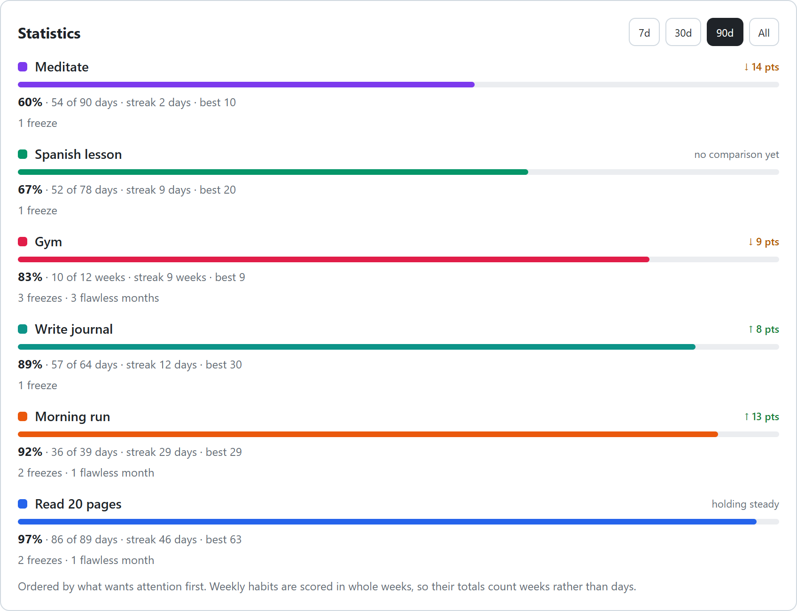
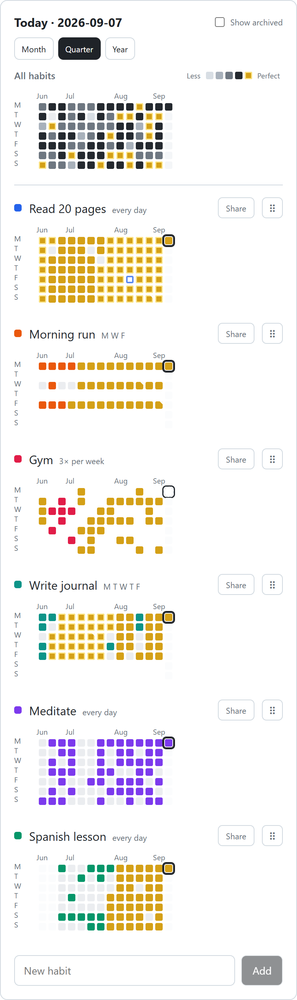
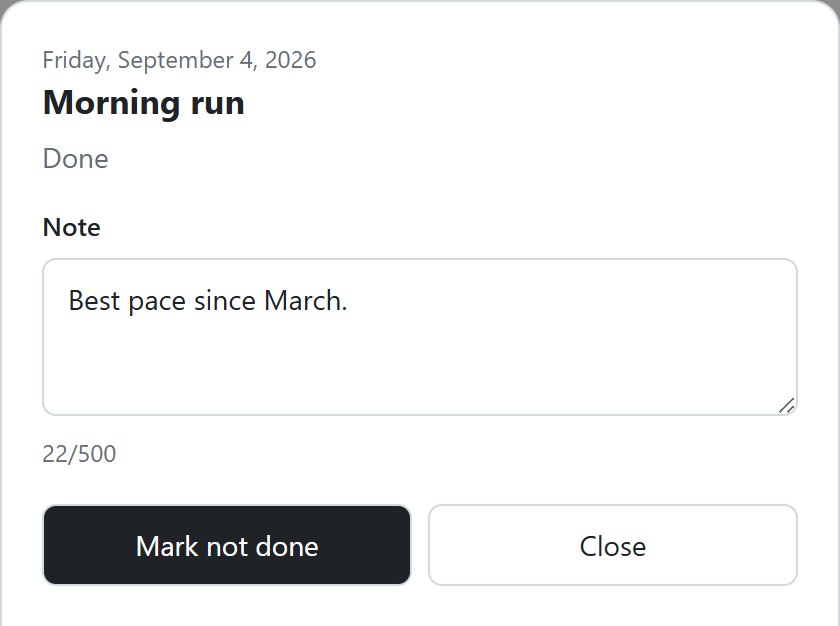
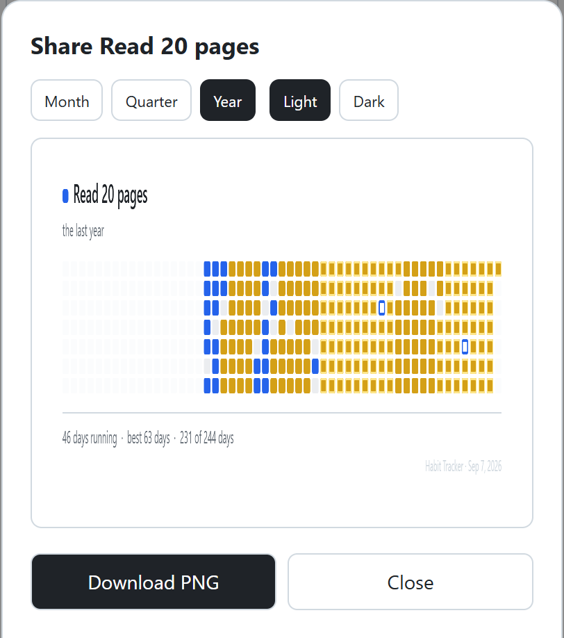

# Habit Tracker

A personal habit tracker that draws each habit as a GitHub-style contribution
heatmap, plus an aggregate heatmap shaded by how much of the day's expected work
was done. It is local-first: every read comes from an IndexedDB mirror, so the
app works with no network and syncs to Supabase when there is one. It installs
as a PWA.

Live at **[habit-tracker-gilt-two.vercel.app](https://habit-tracker-gilt-two.vercel.app)**.
Single-user: sign-ups are closed.

<picture>
  <source media="(prefers-color-scheme: dark)" srcset="docs/img/habits-year-dark.png">
  
</picture>

<sub>Every screenshot here is rendered from synthetic data by
<code>scripts/screenshots.mjs</code>, and follows your GitHub theme.</sub>

## Features

- **A heatmap per habit**, in a chosen colour from a curated palette, over a
  month, quarter or year.
- **An aggregate heatmap** weighted by how much each habit counts: a day with
  an Unskippable habit done reads stronger than one with a Minor habit done.
- **Cadences**: every day, chosen weekdays, or *N* times a week.
- **Streaks**, with a gold mark once a run reaches seven (or four quota-meeting
  weeks), and a second tier beyond that.
- **Statistics**: completion rate and trend over 7 / 30 / 90 days or all time,
  ranked so a habit that is slipping surfaces first.
- **Freeze Tokens**: one a month, spendable to keep a streak alive across a day
  you missed. Unused ones carry over only after a flawless month, up to three.
- **Notes** on a completion, **export and import**, a **daily reminder**, and a
  **shareable PNG**.

### Statistics

The trend compares this window with the one before it; weekly-quota habits are
scored in whole weeks.

<picture>
  <source media="(prefers-color-scheme: dark)" srcset="docs/img/stats-dark.png">
  
</picture>

### On a phone

A tap on today toggles it; a tap on any other day opens that day, with its note
and the option to spend a Freeze.

<table>
  <tr>
    <td width="50%" valign="top">
      <picture>
        <source media="(prefers-color-scheme: dark)" srcset="docs/img/habits-quarter-phone-dark.png">
        
      </picture>
    </td>
    <td width="50%" valign="top">
      <picture>
        <source media="(prefers-color-scheme: dark)" srcset="docs/img/day-detail-dark.png">
        
      </picture>
      <br><br>
      <picture>
        <source media="(prefers-color-scheme: dark)" srcset="docs/img/share-card-dark.png">
        
      </picture>
    </td>
  </tr>
</table>

The share card is a canvas render downloaded as a PNG. Nothing is uploaded and
there are no public links.

## How it works

Vite, React and TypeScript on the client; Postgres, auth and one Edge Function on Supabase.

**Local mirror and outbox.** Dexie over IndexedDB holds a full copy of the
user's rows. Every read in the UI goes to the mirror, never to the network. A
write lands in the mirror and in an outbox table in one transaction, so the UI
updates immediately. A background loop pushes the outbox and pulls rows changed
since each table's cursor, with exponential backoff on failure and an immediate
retry when the tab regains connectivity or focus.

**Last-write-wins per row.** Every row carries a client-set `updated_at`; a
`lww_guard` trigger on the server rejects older writes, and the client applies
the same comparison on pull. This works because a completion is set membership
on `(habit, day)`, a single row with a compound key, rather than a document that
would need merging. [ADR 0002](docs/adr/0002-local-first-last-write-wins-sync.md)

**Dates are plain dates.** A completion is `2026-09-05`, never a timestamp. A
day starts at a configurable hour (04:00 by default), so a late night lands on
the day it belongs to. [ADR 0003](docs/adr/0003-completions-are-plain-local-dates.md)

**Schedules are effective-dated.** Changing a cadence or weight writes a new
schedule row rather than editing the old one, so history is always judged
against the schedule in force at the time. [ADR 0004](docs/adr/0004-effective-dated-cadence-and-weight.md)

**The client owns the rules.** Streaks, rates, freeze balances, flawless months
and aggregate intensity are pure functions of rows (`src/lib/rules.ts`,
`src/lib/stats.ts`), computed on every read and never cached. The server has no
copy of these rules: the reminder function only compares dates against a
`last_clear_day` the client has already written.

**Row-level security is the boundary.** The anon key is public; per-table RLS
policies restrict every operation to the owning user, and `scripts/rls-isolation-test.mjs`
asserts that one account cannot reach another's rows.

## Running it

```sh
npm install
cp .env.example .env.local     # fill in from Supabase → Project Settings → API
npm run dev
```

`npm test` runs 191 vitest tests with no network or browser; `npm run build`
typechecks, bundles and generates the service worker. Migrations, deployment
and the RLS check are in [docs/development.md](docs/development.md).

## Layout

| Path | Contents |
|---|---|
| `src/lib/rules.ts`, `src/lib/stats.ts` | The derivation rules R0–R8 and the statistics built on them |
| `src/lib/db.ts`, `src/lib/store.ts` | The Dexie mirror and every write path (mirror + outbox) |
| `src/lib/sync.ts`, `src/lib/useSync.ts` | Push, pull and the background loop |
| `src/*.tsx` | The UI: heatmaps, editor, day detail, stats, share card, settings |
| `supabase/migrations/` | Schema, RLS policies and the `lww_guard` trigger |
| `supabase/functions/daily-reminder/` | The reminder sender |
| `scripts/` | RLS isolation test and the screenshot renderer |

## Design docs

| | |
|---|---|
| [`docs/CONTEXT.md`](docs/CONTEXT.md) | The glossary: 23 terms, each with the words to avoid. The rest of the docs are written in it. |
| [`docs/derivation-rules.md`](docs/derivation-rules.md) | R0–R8: every derived value as a pure function of rows. |
| [`docs/data-model.md`](docs/data-model.md) | The four tables and the type of each column. |
| [`docs/adr/`](docs/adr/) | Four decisions: Supabase, last-write-wins sync, dates as plain dates, effective-dated schedules. |
| [`docs/roadmap.md`](docs/roadmap.md) | v0 through v4, and what was left out. |
| [`docs/tickets/`](docs/tickets/) | Every ticket, each with a Result recording what was built. |
| [`docs/reminders-setup.md`](docs/reminders-setup.md) | Switching push reminders on. |

More: [development](docs/development.md) covers running, migrations, deployment and the RLS check.
